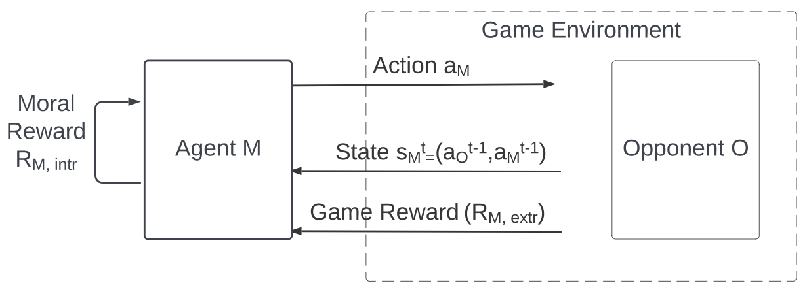
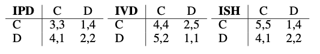

# Modeling Moral Choice in Dyadic Social Dilemmas with Multi-Agent Reinforcement Learning

This repository contains implementation and analysis code for the following paper: 
Modeling Moral Choices in Social Dilemmas with Multi-Agent Reinforcement Learning, IJCAI'23. 

## Cite us
***

If you use this code, please cite the following paper:

```bibtex
@INPROCEEDINGS{TennantMoralRL2023,
    author={Tennant, Elizaveta and Hailes, Stephen and Musolesi, Mirco},
    booktitle={The 32nd International Joint Conference on Artificial Intelligence (IJCAI'23)}, 
    title={Modeling Moral Choices in Social Dilemmas with Multi-Agent Reinforcement Learning}, 
    year={2023},
    pages={...-...},
    venue={Macao, S.A.R.},
    doi={...}
}
```

You can contact the authors at: `l.karmannaya.16@ucl.ac.uk`

## Setup

Intall packages listed in requirements.txt into a Python environment. 
```
pip install -r experiment_data/requirements.txt
```

## The environment 

This code can be used to run a simulation of social dilemma games between two agents - a learning moral agent M and a learning opponent O. 



In particular, we use three social dilemma games (Iterated Prisoner's Dilemma - IPD, Iterated Volunteer's dilemma - IVD, Iterated Stag Hunt - ISH), with the following payoffs: 




## Run the experiments

After installing the required packages (see 'Setup'), you can run the experiments for each dilemma game separately. Run the following steps: 

1. From your Python environment, change to the direcory for the specific dilemma game - e.g. IPD
```
cd IPD
```

2. Run a test - one run between two baseline players. Define required arguments for argparse: --title1, --title2. Also specify --num_runs to do just a single run. The output will be saved in a directory called 'results' within the IPD parent directory. 
```
python3 main.py --title1 QLS --title2 QLS --num_runs 1
```

3. To run the main experiments, run sets of commands from script_for_bash.sh. For example, to run the IPD experiments from the main paper in parallel:
```
python3 main.py --title1 QLS --title2 QLS --eps0 1.0 --epsdecay True &
python3 main.py --title1 QLUT --title2 QLS --eps0 1.0 --epsdecay True &
python3 main.py --title1 QLDE --title2 QLS --eps0 1.0 --epsdecay True &
python3 main.py --title1 QLVE_e --title2 QLS --eps0 1.0 --epsdecay True &
python3 main.py --title1 QLVE_k --title2 QLS --eps0 1.0 --epsdecay True &
python3 main.py --title1 QLVM --title2 QLS --eps0 1.0 --epsdecay True &
python3 main.py --title1 QLUT --title2 QLUT --eps0 1.0 --epsdecay True &
python3 main.py --title1 QLDE --title2 QLUT --eps0 1.0 --epsdecay True &
python3 main.py --title1 QLDE --title2 QLDE --eps0 1.0 --epsdecay True &
python3 main.py --title1 QLVE_e --title2 QLUT --eps0 1.0 --epsdecay True &
python3 main.py --title1 QLVE_e --title2 QLDE --eps0 1.0 --epsdecay True &
python3 main.py --title1 QLVE_e --title2 QLVE_e --eps0 1.0 --epsdecay True &
python3 main.py --title1 QLVE_k --title2 QLUT --eps0 1.0 --epsdecay True &
python3 main.py --title1 QLVE_k --title2 QLDE --eps0 1.0 --epsdecay True &
python3 main.py --title1 QLVE_k --title2 QLVE_e --eps0 1.0 --epsdecay True &
python3 main.py --title1 QLVE_k --title2 QLVE_k --eps0 1.0 --epsdecay True &
python3 main.py --title1 QLVM --title2 QLUT --eps0 1.0 --epsdecay True &
python3 main.py --title1 QLVM --title2 QLDE --eps0 1.0 --epsdecay True &
python3 main.py --title1 QLVM --title2 QLVE_e --eps0 1.0 --epsdecay True &
python3 main.py --title1 QLVM --title2 QLVE_k --eps0 1.0 --epsdecay True &
python3 main.py --title1 QLVM --title2 QLVM --eps0 1.0 --epsdecay True
```

4. to run experiments for a different dilemma game - e.g. IVD:
```
cd ../IVD
#run main.py with each pair of agents as above 
```

## Parameters

manually specified:
```
--eps0 1.0 
--epsdecay True 
```

set by default within main.py:
```
master_seed=1                   (initial seed for SeedSequence in random number generator) 
alpha0=0.0.1 & decay=0.0005     (learning rate for Q-Learning)
num_iterations=10000            (number of iterations within a single runs)
num_runs=100                    (number of runs with different seeds) 
gamma = 0.9                     (discout factor for Q-Learning)
mixed+beta=0.5                  (for Virtue-mixed agent) 
```

## Plotting 

We recommend running specific sections from plotting.py in an IPython environment. Plots will be saved within the specific game's directory, e.g. 'IPD/results/QLS_QLS/plots'.


